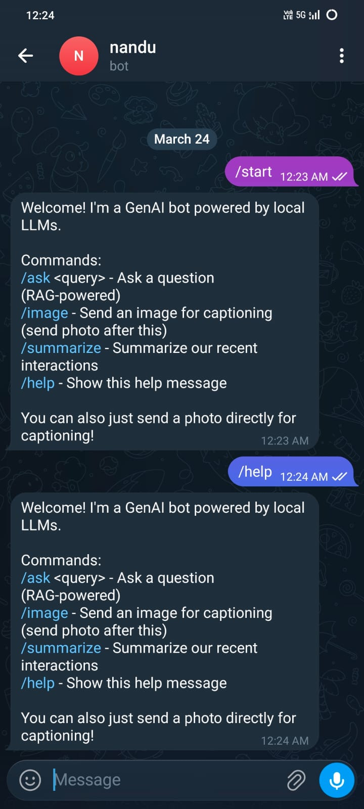
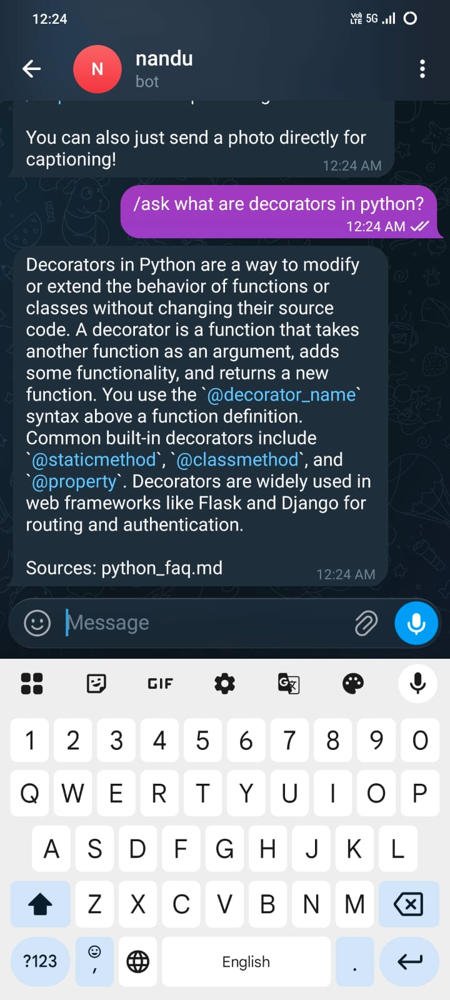
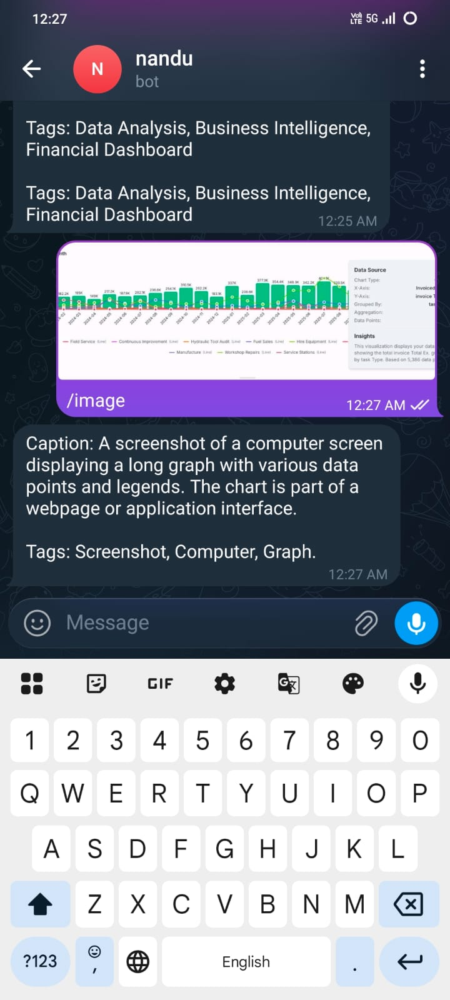
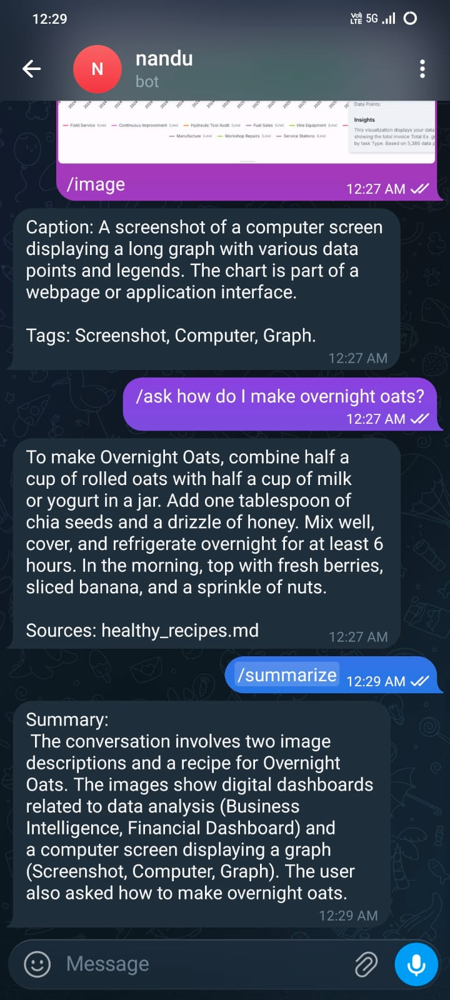

# Hybrid Telegram GenAI Bot (RAG + Vision)

A Telegram bot that answers questions from a local knowledge base using RAG (Retrieval-Augmented Generation) and describes uploaded images using vision AI. All models run locally via Ollama.

**Bot**: [@NVK117bot](https://t.me/NVK117bot)

## Architecture

```
Telegram User
    |
    v
bot.py (python-telegram-bot)
    |
    +--> /ask query --> RAG Pipeline --> Mistral (Ollama)
    |                    |
    |                    +-> Chunk & Embed (sentence-transformers)
    |                    +-> SQLite vector store
    |                    +-> Top-k retrieval + context prompt
    |
    +--> photo upload --> Vision Pipeline --> LLaVA (Ollama)
    |                     |
    |                     +-> Base64 encode image
    |                     +-> Caption + 3 keyword tags
    |
    +--> /summarize --> Mistral (Ollama) --> Summary of recent chats
```

## Models Used

| Model | Purpose | Size | Why |
|-------|---------|------|-----|
| Mistral 7B | RAG text generation | 4.4 GB | Good quality, fast on GPU |
| LLaVA 7B | Image captioning | 4.7 GB | Multimodal via Ollama, unified API |
| all-MiniLM-L6-v2 | Text embeddings | 80 MB | Fast, accurate, runs on CPU |

## Prerequisites

- Python 3.10+
- [Ollama](https://ollama.com/) installed and running
- Ollama models: `ollama pull mistral` and `ollama pull llava`
- A Telegram Bot Token from [@BotFather](https://t.me/BotFather)

## Installation

1. Install dependencies:
   ```bash
   pip install -r requirements.txt
   ```

2. Create a `.env` file with your Telegram token:
   ```
   TELEGRAM_BOT_TOKEN=your_token_here
   ```
3. Ingest the knowledge base:
   ```bash
   python ingest.py
   ```

4. Run the bot:
   ```bash
   python bot.py
   ```

## Commands

| Command | Description |
|---------|-------------|
| `/help` | Show usage instructions |
| `/ask <query>` | Ask a question answered from the knowledge base |
| `/image` | Prompt to send an image for captioning |
| `/summarize` | Summarize the last 3 interactions |

You can also send a photo directly without the `/image` command.

## Features

- **RAG Pipeline**: Chunks documents, embeds with sentence-transformers, stores in SQLite, retrieves top-3 matches, generates answer with Mistral
- **Vision Pipeline**: Accepts photos, generates captions and keyword tags with LLaVA
- **Message History**: Maintains last 3 interactions per user for context-aware answers
- **Query Caching**: Repeated questions return cached answers instantly
- **Source Attribution**: Shows which knowledge documents were used to answer

## Knowledge Base Topics

- Python FAQ (decorators, GIL, list vs tuple, etc.)
- Healthy Recipes (overnight oats, Greek salad, lentil soup, etc.)
- Git Basics (branching, merging, rebasing, stashing)
- Machine Learning Concepts (supervised/unsupervised, overfitting, cross-validation)
- Cybersecurity Basics (phishing, passwords, 2FA, VPNs)

## Demo Screenshots

### /help Command


### /ask - RAG Query (Python)


### /ask - RAG Query (Recipes)


### Image Captioning


### /summarize


## Project Structure

```
teligram/
├── bot.py              # Telegram bot handlers
├── config.py           # Configuration constants
├── ingest.py           # Knowledge base ingestion script
├── rag/
│   ├── embedder.py     # Text chunking and embedding
│   ├── store.py        # SQLite storage for embeddings
│   └── retriever.py    # Retrieval and answer generation
├── vision/
│   └── captioner.py    # Image captioning with LLaVA
├── knowledge/          # 5 Markdown knowledge documents
├── db/                 # SQLite database (auto-created)
├── requirements.txt
├── .env                # Bot token (not committed)
└── README.md
```
